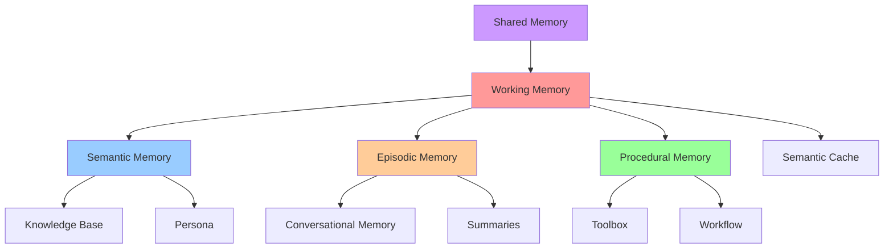

# MemoRizz Memory Architecture

This document provides an overview of the complete memory architecture in MemoRizz, organized according to cognitive science principles and practical AI agent requirements.

## 🧠 Memory Type Classification

The MemoRizz memory system is organized into **cognitively-inspired categories** that mirror human memory systems, plus a specialized **coordination layer** for multi-agent scenarios.

```
src/memorizz/
├── long_term_memory/           # Persistent, learned information
│   ├── semantic/              # Facts, concepts, knowledge
│   │   └── entity_memory/     # Structured facts about specific entities
│   ├── procedural/            # Skills, behaviors, processes
│   └── episodic/              # Experiences, events, history
├── short_term_memory/         # Temporary, active processing
│   ├── semantic_cache/        # Temporary fact storage
│   └── working_memory/        # Active workspace & context management
└── coordination/              # Multi-agent communication (not cognitive)
    └── shared_memory/         # Inter-agent coordination
```

## 📚 Long-Term Memory Systems

### 🔍 Semantic Memory (`long_term_memory/semantic/`)
**"What I know"** - Factual and conceptual knowledge

- **Purpose**: Store and retrieve objective facts, concepts, and structured entity information
- **Components**: Knowledge Base, Persona (identity/behavior), Entity Memory
- **Use Cases**: Question answering, fact retrieval, domain expertise
- **Examples**: "Python is a programming language", "The capital of France is Paris"

**Key Features:**
- Vector-based semantic search
- Namespace organization by domain
- Agent-scoped knowledge bases
- Embedding-powered relevance matching
- Entity memory for persistent attribute–value pairs tied to specific people, products, or organizations
- **Persona**: Behavioral patterns and identity consistency
- **Entity Memory**: Structured profiles with attributes, relations, and provenance that survive across sessions

Entity memory enables personalization and consistent reasoning: every agent can recall
stable facts (preferences, org metadata, device details, etc.), update them with new
evidence, and expose the information to LLMs via dedicated lookup/upsert tools.

### ⚙️ Procedural Memory (`long_term_memory/procedural/`)
**"How I act and what I can do"** - Behavioral patterns and executable skills

- **Purpose**: Store learned behaviors, tools, and complex processes
- **Components**: Toolbox (skills), Workflow (processes)
- **Use Cases**: Consistent personality, tool execution, process automation
- **Examples**: "How to respond as a customer service agent", "How to debug code", "How to conduct research"

**Key Features:**
- **Toolbox**: Executable functions with semantic discovery
- **Workflow**: Multi-step process orchestration

### 📖 Episodic Memory (`long_term_memory/episodic/`)
**"What I've experienced"** - Personal experiences and temporal context

- **Purpose**: Store time-stamped experiences and interaction history
- **Components**: Conversational Memory Units, Summary Components
- **Use Cases**: Conversation continuity, relationship building, experience learning
- **Examples**: "Yesterday's conversation about debugging", "User prefers email communication"

**Key Features:**
- Time-stamped interaction records
- Automatic memory summarization
- Relationship and context tracking
- Emotional and situational tagging

## ⚡ Short-Term Memory Systems

### 💾 Semantic Cache (`short_term_memory/semantic_cache/`)
**"Temporary facts I'm holding"** - Short-term fact storage

- **Purpose**: Temporarily cache frequently accessed information
- **Use Cases**: Performance optimization, session-specific data
- **Integration**: Works with memory providers for persistence

### 🧠 Working Memory (`short_term_memory/working_memory/`)
**"My active thinking space"** - Context window management and active processing

- **Purpose**: Manage limited attention spans and integrate information from all memory systems
- **Components**: Context Window Management (CWM)
- **Use Cases**: Token optimization, memory integration, attention management

**Key Features:**
- Context window optimization for LLMs
- Memory system integration and coordination
- Dynamic prompt generation
- Attention management and focus control

## 🤝 Coordination Memory

### 🔗 Shared Memory (`coordination/shared_memory/`)
**"How we communicate"** - Multi-agent coordination (not cognitive memory)

- **Purpose**: Enable communication and coordination between multiple agents
- **Components**: Blackboard architecture for agent coordination
- **Use Cases**: Multi-agent workflows, task delegation, collaborative problem-solving

**Key Features:**
- Session-based multi-agent coordination
- Message-based communication patterns
- Hierarchical agent organization
- Task delegation and result integration

## 🏗️ Integration Architecture

### Memory System Relationships



### Application Mode Integration

Different application modes activate different memory combinations:

```python
# ASSISTANT Mode - General conversational agent
active_memory_types = [
    MemoryType.CONVERSATION_MEMORY,    # Episodic
    MemoryType.LONG_TERM_MEMORY,       # Semantic
    MemoryType.PERSONAS,               # Procedural
    MemoryType.SHORT_TERM_MEMORY,      # Working
    MemoryType.SUMMARIES               # Episodic compression
]

# WORKFLOW Mode - Task-oriented agent
active_memory_types = [
    MemoryType.WORKFLOW_MEMORY,        # Procedural
    MemoryType.TOOLBOX,                # Procedural
    MemoryType.LONG_TERM_MEMORY,       # Semantic
    MemoryType.SHORT_TERM_MEMORY       # Working
]

# DEEP_RESEARCH Mode - Research and analysis
active_memory_types = [
    MemoryType.TOOLBOX,                # Procedural
    MemoryType.SHARED_MEMORY,          # Coordination
    MemoryType.LONG_TERM_MEMORY,       # Semantic
    MemoryType.SHORT_TERM_MEMORY       # Working
]
```

## 🚀 Usage Patterns

### Single Agent with Complete Memory

```python
from memorizz import MemAgent, MongoDBProvider

# Agent with full memory systems
agent = MemAgent(
    application_mode="assistant",
    memory_provider=MongoDBProvider(config),
    instruction="Helpful assistant with complete memory"
)

# Memory systems work together automatically:
response = agent.run("Remember our Python discussion from yesterday?")
# Uses: episodic (yesterday's conversation) + semantic (Python knowledge) +
#       procedural (how to help) + working (current context)
```

### Multi-Agent Coordination

```python
from memorizz.coordination import SharedMemory

# Set up multi-agent coordination
shared_memory = SharedMemory(memory_provider)
session_id = shared_memory.create_shared_session(
    root_agent_id="orchestrator",
    delegate_agent_ids=["researcher", "analyst", "writer"]
)

# Each agent maintains individual memory + shared coordination
orchestrator = MemAgent(shared_memory_session_id=session_id)
researcher = MemAgent(shared_memory_session_id=session_id)
```

### Memory-Specific Operations

```python
# Semantic memory - Knowledge management
from memorizz.long_term_memory.semantic import KnowledgeBase
kb = KnowledgeBase(memory_provider)
kb.ingest_knowledge("AI knowledge...", namespace="artificial_intelligence")

# Procedural memory - Skill and behavior management
from memorizz.long_term_memory.procedural import Persona, Toolbox
persona = Persona("TechExpert", "Technical Support Specialist")
toolbox = Toolbox(memory_provider)

# Episodic memory - Experience tracking
# (Handled automatically by MemAgent during conversations)

# Working memory - Context optimization
from memorizz.short_term_memory.working_memory import CWM
context_prompt = CWM.get_prompt_from_memory_types(active_memory_types)
```

## 📖 Component Documentation

Each memory component includes comprehensive documentation:

- **`semantic/README.md`** - Knowledge base usage and semantic memory patterns
- **`procedural/README.md`** - Behavioral patterns, tools, and workflows
- **`episodic/README.md`** - Experience tracking and conversation memory
- **`working_memory/README.md`** - Context management and memory integration
- **`coordination/README.md`** - Multi-agent coordination and communication

## 🔄 Migration Notes

### Import Changes

The reorganization updates import paths:

```python
# OLD imports
from memorizz.persona import Persona
from memorizz.toolbox import Toolbox
from memorizz.shared_memory import SharedMemory

# NEW imports
from memorizz.long_term_memory.semantic.persona import Persona
from memorizz.long_term_memory.procedural.toolbox import Toolbox
from memorizz.coordination.shared_memory import SharedMemory

# OR use the main module imports
from memorizz import Persona, Toolbox, SharedMemory  # Still works!
```

### Backward Compatibility

The main `memorizz` module maintains backward compatibility:

```python
# These imports still work
from memorizz import MemAgent, Persona, Toolbox, KnowledgeBase
```

## 🎯 Benefits of This Architecture

1. **Cognitive Clarity**: Maps to established cognitive science memory types
2. **Modular Design**: Each memory type can be used independently or together
3. **Scalable Coordination**: Supports both single and multi-agent scenarios
4. **Performance Optimization**: Working memory manages context windows effectively
5. **Developer Experience**: Clear separation of concerns and comprehensive documentation

This architecture enables sophisticated AI agents that can learn facts, develop skills, remember experiences, optimize their thinking, and coordinate with other agents - providing a complete cognitive memory framework for AI systems.
